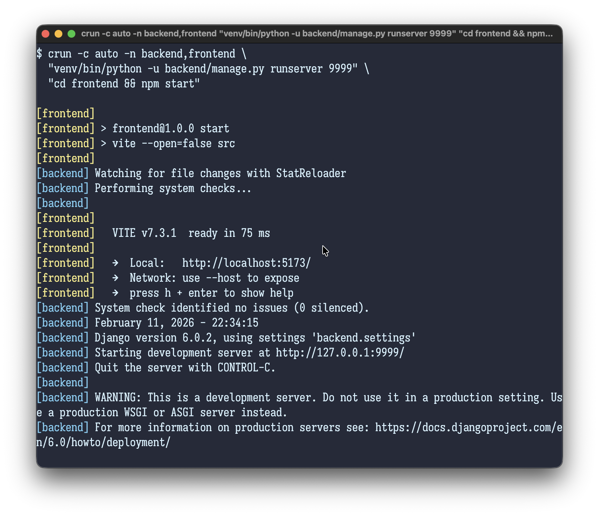

# crun

**C**oncurrent **Run**

A Rust port of [concurrently](https://github.com/open-cli-tools/concurrently) — run commands concurrently.

`crun` is useful when you need to do something like start a web server for your backend and frontend at the same time, and you want the logs streamed to you in such a way that you can easily tell which logs came from which service. You can use `ctrl-c` to kill all the services at the same time.



## Installation

```bash
# Homebrew
brew install llimllib/tap/crun

# Cargo
cargo install crun
```

## Usage

```bash
# Run two commands concurrently
crun "echo foo" "echo bar"

# Name processes and colorize output
crun -c auto -n celery,django,webpack \
    "pdm run python manage.py runcelery" \
    "pdm run python manage.py runserver localhost:8000" \
    "npm start"

# Kill all processes when one exits
crun -k "npm run watch" "cargo run -- serve"

# Kill others only on failure
crun --kill-others-on-fail "npm test" "cargo test"
```

## Options

```
General:
  -n, --names <NAMES>              Comma-separated names for each process
  --name-separator <SEP>           Character to split names on (default: ,)
  -s, --success <CONDITION>        Exit condition: all, first, last (default: all)
  -r, --raw                        Output raw process output, no prefixes
  --no-color                       Disable colored output
  --hide <PROCESSES>               Hide output from processes (by index or name)
  -g, --group                      Group output per process (buffer until exit)
  --timings                        Show timing information for all processes
  -P, --passthrough-arguments      Pass arguments after -- as placeholders

Prefix styling:
  -p, --prefix <TYPE>              Prefix type: index, pid, time, command, name, none
  -c, --prefix-colors <COLORS>     Comma-separated colors (auto, red, green.bold, etc.)
  -l, --prefix-length <N>          Max prefix length for command names (default: 10)
  --pad-prefix                     Pad all prefixes to the same length

Kill others:
  -k, --kill-others                Kill other processes when one exits
  --kill-others-on-fail            Kill others only if one exits with non-zero code

Input:
  -i, --handle-input               Forward stdin to child processes
  --default-input-target <N>       Default process to receive stdin (default: 0)

Restart:
  --restart-tries <N>              Restart failed processes N times (negative = infinite)
  --restart-after <MS>             Delay before restart in milliseconds

Teardown:
  --teardown <CMD>                 Command to run after all processes exit (repeatable)
```

## Colors

Use `-c auto` to automatically color each process prefix, or specify colors per process:

```bash
crun -c "red,green,blue" "cmd1" "cmd2" "cmd3"
crun -c "red.bold,auto" "cmd1" "cmd2" "cmd3"
```

Supported colors: `black`, `red`, `green`, `yellow`, `blue`, `magenta`, `cyan`, `white`, `grey`/`gray`, plus `Bright` variants (e.g. `greenBright`) and background variants (e.g. `bgRed`, `bgCyanBright`).

Modifiers: `bold`, `dim`, `italic`, `underline`, `inverse`, `strikethrough`.

Combine with dot notation: `red.bold`, `bgBlue.white`.

## Development

```bash
make check            # fmt, clippy, doc, build
make test             # unit tests
make integration-test # build release, run JS test suite
make test-linux       # run all tests in a Linux container
make release          # bump version, tag, push
```

## License

MIT
